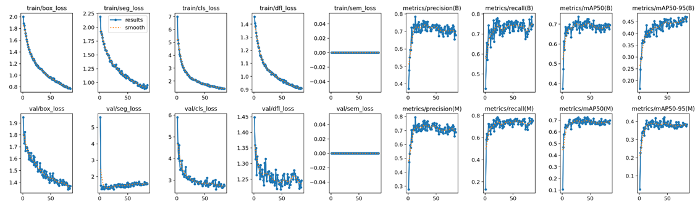
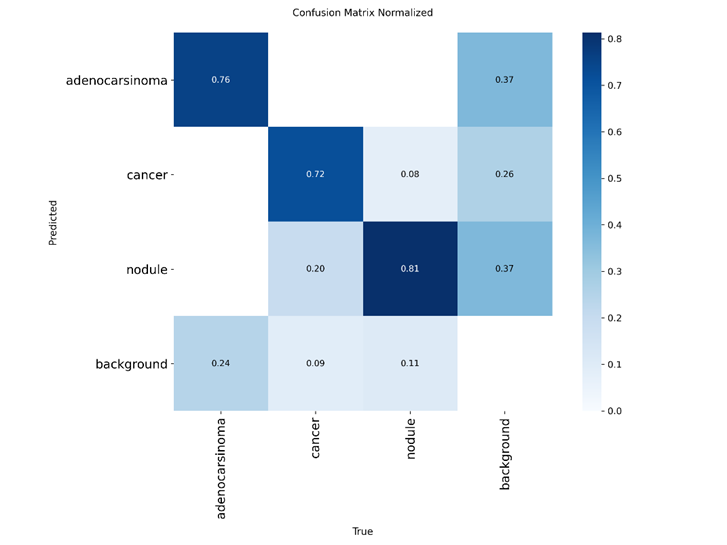
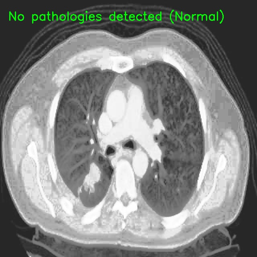
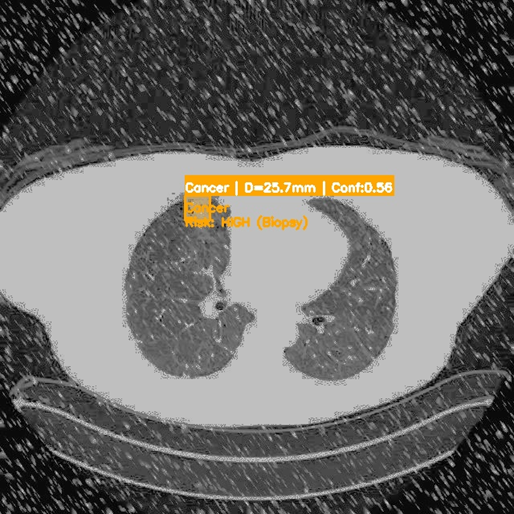
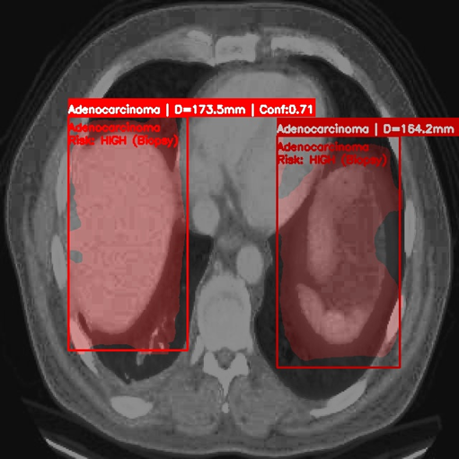

# Обучение YOLOv8-seg для детекции и сегментации лёгочных образований на КТ

Индивидуальная работа по дисциплине «Архитектура компьютера». Цель — обучить
сверточную нейросеть автоматически находить, сегментировать и классифицировать
патологические образования на КТ-снимках грудной клетки, а по размеру узла
предварительно оценивать стадию риска (аппроксимация шкалы Lung-RADS).

Система на одном проходе модели решает три связанные подзадачи:

1. **Детекция** — координаты ограничивающей рамки вокруг образования.
2. **Сегментация** — точная пиксельная маска для расчёта площади.
3. **Классификация** — тип патологии: `adenocarcinoma`, `cancer`, `nodule`.

Поверх сегментации работает модуль оценки стадии: по маске вычисляется физический
диаметр узла и образование относится к категории наблюдения, подозрения или
высокого риска.

---

## Стек

Python 3, PyTorch, Ultralytics (YOLOv8-seg), OpenCV, NumPy, Matplotlib.
Полный список зависимостей — в `requirements.txt`.

---

## Архитектура

Базовая модель — **YOLOv8s-seg** (small, segmentation): 86 слоёв, ~11.8 млн
параметров. Версия `-seg` содержит голову сегментации, дающую бинарные маски
объектов, что необходимо для расчёта площади и диаметра. Предобучение на COCO
используется как трансфер: общие признаки границ и текстур ускоряют сходимость
на медицинских данных.

### Обучение

Конфиг датасета (`data.yaml`) и предобученные веса `yolov8s-seg.pt` подтягиваются
Ultralytics автоматически. Ключевые гиперпараметры:

| Группа | Параметры |
| :--- | :--- |
| Базовые | `epochs=120`, `imgsz=640`, `batch=12`, `optimizer=AdamW`, `lr0=0.001`, `seed=42` |
| Аугментации | `mosaic=0.3`, `mixup=0.1`, `copy_paste=0.2` |
| Функция потерь | `box=7.5`, `cls=1.5`, `dfl=1.5` |
| Стратегия | `patience=40` (ранний стоп), `close_mosaic=20`, `amp=False` |

Пониженная вероятность мозаики сохраняет анатомическую целостность лёгких;
`copy_paste` улучшает сегментацию редких классов; увеличенный вес `cls` лучше
разделяет типы опухолей при дисбалансе классов. Смешанная точность (`amp`)
отключена для численной стабильности на медицинских данных. Лучшая версия
сохраняется как `best.pt` по метрике mAP.

### Инференс и оценка стадии

Для каждого обнаруженного объекта площадь маски переводится в физический диаметр
и сопоставляется со стадией риска:

```text
S_px = сумма пикселей маски (значения > 0.5)
S_mm = S_px * k^2,   k = 0.7 мм/пиксель (усреднённое разрешение)
D    = 2 * sqrt(S_mm / pi)

класс Adenocarcinoma или Cancer  ->  риск HIGH (подтверждён)
класс Nodule:
    D < 6 мм        ->  Стадия I    (наблюдение)
    6 <= D <= 30 мм ->  Стадия II   (подозрение)
    D > 30 мм       ->  Стадия III+ (высокий риск)
```

Пороги детекции: `conf=0.4`, `iou=0.5`. Результат визуализируется с наложением
полупрозрачной маски, рамки и текстовой подписи (класс, диаметр, уверенность,
стадия).

---

## Датасет

Набор медицинских изображений КТ грудной клетки в формате инстанс-сегментации
YOLO, разделённый на обучающую, валидационную и тестовую выборки.

- **Классы:** `adenocarcinoma`, `cancer`, `nodule` (`nc = 3`).
- **Валидация:** 332 размеченных экземпляра на 324 изображениях.
- **Особенность:** дисбаланс классов (преобладание `nodule`), что и обусловило
  выбор аугментаций и взвешивания потерь.

Исходные изображения в репозиторий **не включены** (объём и условия
распространения медицинских данных). Для воспроизведения подготовьте датасет
локально в структуре:

```text
dataset/
├── images/
│   ├── train/
│   ├── val/
│   └── test/
└── labels/
    ├── train/
    ├── val/
    └── test/
```

Файл разметки `labels/*/*.txt` — по строке на экземпляр:
`class_id x1 y1 x2 y2 ... xn yn` (нормализованные координаты полигона).
Пути и классы задаются в `data.yaml`.

---

## Результаты

Обучение прошло без численной нестабильности (NaN/Inf). Итоговые метрики на
валидации (P — Precision, R — Recall):

| Класс | Images | Instances | Box P | Box R | Box mAP50 | Box mAP50-95 | Mask mAP50-95 |
| :--- | ---: | ---: | ---: | ---: | ---: | ---: | ---: |
| all | 324 | 332 | 0.733 | 0.759 | 0.726 | 0.462 | 0.424 |
| adenocarcinoma | 41 | 45 | 0.733 | 0.733 | 0.723 | 0.439 | 0.488 |
| cancer | 45 | 46 | 0.581 | 0.761 | 0.611 | 0.484 | 0.378 |
| nodule | 238 | 241 | 0.887 | 0.784 | 0.845 | 0.462 | 0.405 |

**Как читать цифры в медицинском контексте:**

- **Recall для `cancer` = 0.761** — ключевой итог работы: модель находит более 76%
  злокачественных образований. В скрининге пропуск опухоли опаснее ложного
  срабатывания, поэтому стратегия «лучше перепроверить, чем пропустить» здесь
  предпочтительна; именно её поддержали отключение `amp` и веса потерь.
- **Precision для `nodule` = 0.887** — система редко даёт ложные срабатывания на
  узлах, обнаруженному образованию можно доверять.
- **mAP50 = 0.726** по всем классам — модель уверенно локализует большинство
  узлов.
- **Разрыв детекции и сегментации мал** (Box mAP50-95 = 0.462 против Mask
  mAP50-95 = 0.424): маски близко соответствуют реальным границам образований,
  что напрямую повышает надёжность расчёта диаметра и, следственно, стадии.

### Динамика обучения и матрица ошибок





---

## Примеры работы

Одновременная детекция, сегментация и оценка стадии на реальных КТ-срезах.

**Норма, опасности не выявлено** 



**Злокачественное образование (высокий риск)** — класс Cancer/Adenocarcinoma,
требует обследования независимо от размера.



**Крупный узелок, Стадия III+** — диаметр более 30 мм, высокая вероятность
малигнизации.



---

## Установка и запуск

Для обучения нужен GPU с CUDA (на CPU процесс практически неприменим).

```bash
# 1. Виртуальное окружение
python -m venv .venv
source .venv/bin/activate            # Windows: .venv\Scripts\activate

# 2. Зависимости
pip install -r requirements.txt
# Для GPU torch ставится с нужного индекса CUDA, например:
# pip install torch --index-url https://download.pytorch.org/whl/cu121

# 3. Обучение (yolov8s-seg.pt подтянется автоматически)
python train_100.py                  # или python train2.py

# 4. Инференс со стажингом (best.pt появляется в runs/segment/.../weights/)
python predict_staging.py
```

**Перед запуском проверьте два места:**

- В `data.yaml` поля `path`, `train`, `val`, `test` должны указывать на ваш
  локальный датасет (при необходимости замените пути под свою машину).
- В `predict_staging.py` константа `MODEL_PATH` по умолчанию равна
  `runs/segment/train/weights/best.pt`; Ultralytics нумерует запуски
  (`train`, `train2`, ...), поэтому после обучения сверьте актуальный номер
  папки и поправьте путь, если веса легли иначе.

---

## Структура репозитория

```text
.
├── data.yaml                 # конфиг датасета YOLO-seg (пути, nc, names)
├── train2.py                 # скрипт обучения (итерация гиперпараметров)
├── train_100.py              # скрипт обучения (итерация гиперпараметров)
├── predict_staging.py        # инференс, расчёт диаметра, оценка стадии
├── requirements.txt          # зависимости Python
├── .gitignore                # исключения данных, весов и артефактов
├── README.md
└── docs/
    ├── metrics/              # графики обучения и матрица ошибок
    └── examples/             # примеры визуализации результатов
```

В репозиторий намеренно не входят датасет (`dataset*/`), веса моделей
(`*.pt`, `*.h5`), артефакты обучения и инференса (`runs/`, `results_staging/`) и
виртуальное окружение (`.venv/`) — всё это воспроизводится кодом или скачивается
автоматически; содержательная часть (графики и примеры) скопирована в `docs/`.

---

## Ограничения и дисклеймер

- Работа носит учебно-исследовательский характер и **не является медицинским
  изделием**; не предназначена для клинической диагностики.
- Перевод пикселей в миллиметры выполнен по усреднённому разрешению
  0.7 мм/пиксель; для реальной задачи необходимо читать фактическое пространство
  вокселей из метаданных DICOM каждого снимка.
- Границы стадий и порог уверенности — аппроксимация шкалы Lung-RADS, не
  прошедшая клинической валидации.

---

## Об авторе и работе

Индивидуальная работа по дисциплине «Архитектура компьютера».
Автор: Гаврилова Полина Валерьевна.
Санкт-Петербургский политехнический университет Петра Великого, 2026.